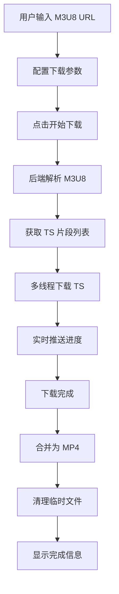
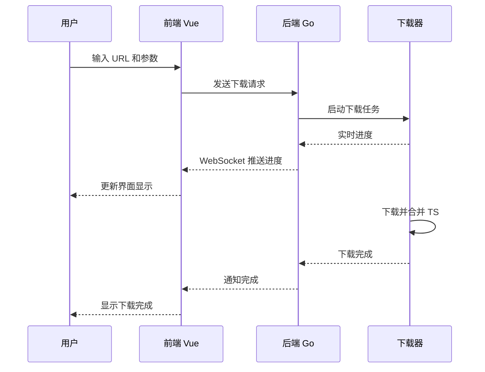

# M3U8 下载器 Web UI 产品需求文档

## 1. 产品概述

基于现有的 Go 语言 m3u8 下载器，创建一个现代化的 Web 用户界面，允许用户通过浏览器配置下载参数、监控下载进度、管理下载任务。

- **核心目的**：将命令行工具转换为可视化 Web 应用，降低使用门槛，提升用户体验
- **目标用户**：普通用户、视频内容创作者、需要批量下载流媒体的用户
- **核心价值**：简化操作流程，提供实时反馈，支持多任务管理

## 2. 核心功能

### 2.1 用户角色

本系统为单用户应用，无需复杂的权限管理：

| 角色 | 说明 | 核心权限 |
|------|------|----------|
| 普通用户 | 使用浏览器的任何用户 | 完整功能访问 |

### 2.2 功能模块

1. **主页/下载页面**：URL 输入、参数配置、下载控制
2. **任务列表页面**：下载历史、任务状态、文件管理
3. **设置页面**：默认参数配置、下载路径设置

### 2.3 页面详情

#### 2.3.1 下载页面（首页）

| 模块名称 | 功能描述 |
|----------|----------|
| URL 输入区 | 输入 m3u8 链接地址，支持粘贴和手动输入 |
| 参数配置区 | 设置线程数、输出文件名、Cookie 等参数 |
| 下载控制区 | 开始下载、暂停、停止、重置按钮 |
| 进度显示区 | 实时显示下载进度、速度、剩余时间 |
| 日志输出区 | 显示详细下载日志和错误信息 |
| 预览区 | 显示已下载视频的基本信息 |

#### 2.3.2 任务列表页面

| 模块名称 | 功能描述 |
|----------|----------|
| 任务表格 | 展示所有下载任务，包括名称、状态、时间等 |
| 状态筛选 | 按全部/下载中/已完成/失败筛选 |
| 操作按钮 | 查看详情、删除、重新下载 |

#### 2.3.3 设置页面

| 模块名称 | 功能描述 |
|----------|----------|
| 默认参数 | 设置默认线程数、输出目录等 |
| 服务器配置 | 后端 API 地址配置 |
| 清理设置 | 自动清理 TS 文件开关 |

## 3. 核心流程

### 3.1 下载流程



### 3.2 用户交互流程



## 4. 用户界面设计

### 4.1 设计风格

- **视觉风格**：现代极简主义，深色主题
- **主色调**：深蓝灰色系 (#1a1a2e, #16213e)
- **强调色**：科技蓝 (#00d4ff) 和成功绿 (#00ff88)
- **按钮风格**：圆角按钮，带有微妙的发光效果
- **字体**：使用 Inter 作为主字体，搭配 Roboto Mono 显示技术信息
- **布局**：卡片式布局，清晰的视觉层次
- **图标**：使用 Lucide 图标库，简洁现代
- **动画**：流畅的过渡动画，进度条动画，微交互反馈

### 4.2 页面设计概览

#### 下载页面布局

```
┌─────────────────────────────────────────┐
│  Logo        [下载] [任务] [设置]        │  导航栏
├─────────────────────────────────────────┤
│                                         │
│  ┌─────────────────────────────────┐    │
│  │  🔗 M3U8 地址输入               │    │  主输入区
│  │  [粘贴或输入 m3u8 链接...]      │    │
│  └─────────────────────────────────┘    │
│                                         │
│  ┌──────────────┐ ┌──────────────┐      │
│  │ 线程数: 24   │ │ 文件名: movie │      │  参数卡片
│  │ [滑块]      │ │ [输入框]      │      │
│  └──────────────┘ └──────────────┘      │
│                                         │
│  ┌─────────────────────────────────┐    │
│  │ [▶ 开始下载]  [⏸ 暂停]         │    │  控制按钮
│  └─────────────────────────────────┘    │
│                                         │
│  ┌─────────────────────────────────┐    │
│  │ 下载进度                         │    │
│  │ ████████████░░░░░░░░  65%      │    │  进度显示
│  │ 速度: 2.5 MB/s | 剩余: 00:30    │    │
│  └─────────────────────────────────┘    │
│                                         │
│  ┌─────────────────────────────────┐    │
│  │ [INFO] 正在解析 m3u8...         │    │  日志输出
│  │ [INFO] 发现 120 个 TS 片段      │    │
│  │ [DEBUG] 下载中: segment_001.ts  │    │
│  └─────────────────────────────────┘    │
│                                         │
└─────────────────────────────────────────┘
```

### 4.3 响应式设计

- **桌面优先**：主要针对桌面浏览器优化
- **平板适配**：支持平板横屏使用
- **移动端**：基本支持，建议使用桌面设备

### 4.4 特殊效果

- 进度条采用渐变动画效果
- 按钮悬停时带有柔和的阴影扩散
- 成功状态带有脉冲动画
- 错误状态带有轻微抖动效果
