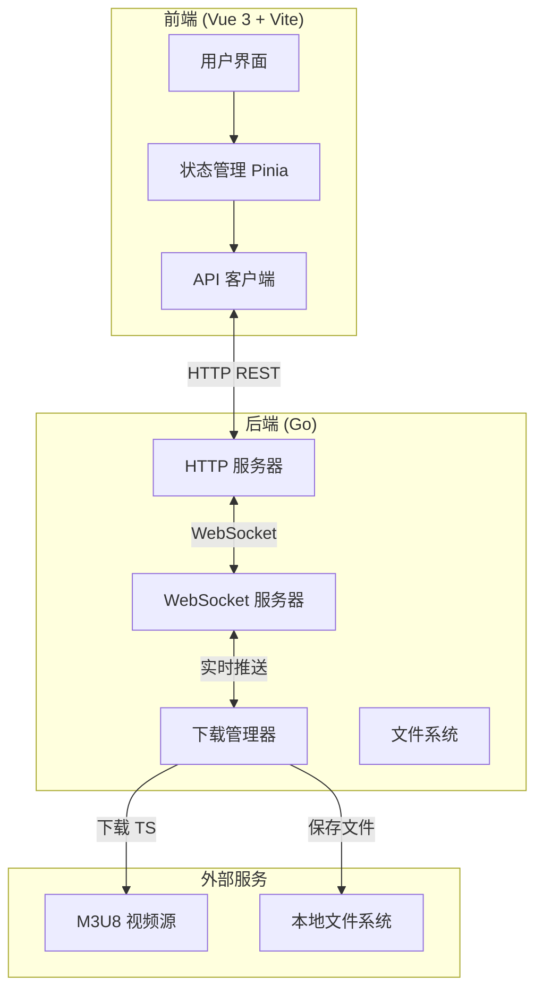
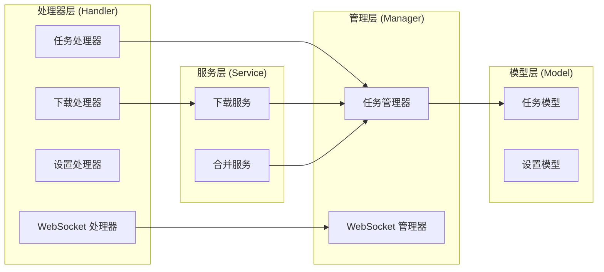
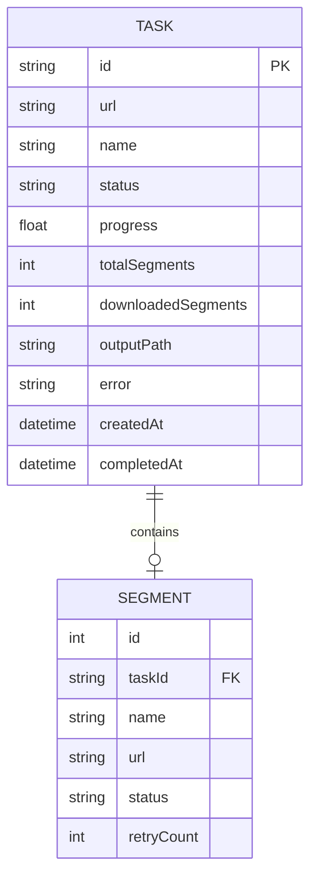
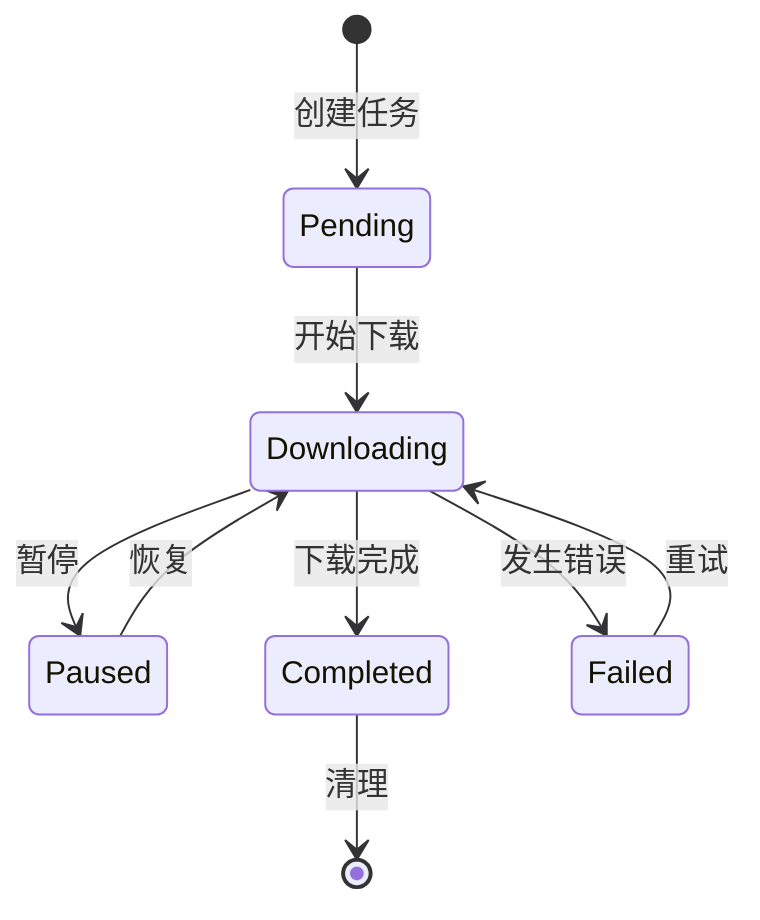

# M3U8 下载器 Web UI 技术架构文档

## 1. 架构设计

### 1.1 整体架构



### 1.2 技术栈选择

| 层级 | 技术 | 版本 | 说明 |
|------|------|------|------|
| 前端框架 | Vue | 3.4+ | 组合式 API |
| 构建工具 | Vite | 5.0+ | 快速开发体验 |
| 状态管理 | Pinia | 2.1+ | Vue 3 官方推荐 |
| HTTP 客户端 | Axios | 1.6+ | API 通信 |
| UI 组件 | TailwindCSS | 3.4+ | 样式框架 |
| 后端框架 | net/http | Go 标准库 | HTTP 服务器 |
| WebSocket | gorilla/websocket | 1.5+ | WebSocket 支持 |
| 文件处理 | 标准库 | - | OS 和 io 操作 |

## 2. 技术描述

### 2.1 前端技术栈

- **框架**：Vue 3.4+ (Composition API)
- **构建工具**：Vite 5.0+
- **路由**：Vue Router 4
- **状态管理**：Pinia 2.1+
- **HTTP 客户端**：Axios 1.6+
- **样式方案**：TailwindCSS 3.4+
- **图标**：Lucide Vue
- **实时通信**：WebSocket (原生)

### 2.2 后端技术栈

- **语言**：Go 1.16+
- **HTTP 框架**：net/http (标准库)
- **WebSocket**：gorilla/websocket 1.5+
- **HTTP 客户端**：grequests (复用现有依赖)
- **并发控制**：sync.WaitGroup + channel
- **日志**：标准 log 包

### 2.3 项目结构

```
m3u8-downloader-master/
├── backend/                    # Go 后端
│   ├── main.go                # 主程序入口
│   ├── handler/               # HTTP 处理器
│   │   ├── download.go        # 下载相关 API
│   │   └── task.go            # 任务管理 API
│   ├── service/               # 业务逻辑
│   │   ├── downloader.go      # 下载器服务
│   │   └── merger.go          # 文件合并服务
│   ├── websocket/             # WebSocket 处理
│   │   └── client.go          # WebSocket 客户端管理
│   └── model/                # 数据模型
│       └── task.go            # 任务数据结构
├── frontend/                  # Vue 前端
│   ├── src/
│   │   ├── assets/           # 静态资源
│   │   ├── components/        # 组件
│   │   │   ├── UrlInput.vue   # URL 输入组件
│   │   │   ├── ParamConfig.vue # 参数配置组件
│   │   │   ├── ProgressBar.vue # 进度条组件
│   │   │   └── LogViewer.vue  # 日志查看器
│   │   ├── views/             # 页面
│   │   │   ├── DownloadView.vue # 下载页面
│   │   │   ├── TaskListView.vue # 任务列表页面
│   │   │   └── SettingsView.vue # 设置页面
│   │   ├── stores/            # Pinia 状态
│   │   │   ├── download.js    # 下载状态
│   │   │   └── settings.js    # 设置状态
│   │   ├── api/               # API 调用
│   │   │   └── index.js        # API 封装
│   │   ├── router/             # 路由配置
│   │   │   └── index.js
│   │   ├── App.vue             # 根组件
│   │   └── main.js             # 入口文件
│   ├── index.html
│   ├── vite.config.js
│   ├── tailwind.config.js
│   └── package.json
└── README.md
```

## 3. 路由定义

### 3.1 前端路由

| 路由 | 页面 | 说明 |
|------|------|------|
| `/` | DownloadView | 下载页面（首页） |
| `/tasks` | TaskListView | 任务列表页面 |
| `/settings` | SettingsView | 设置页面 |

### 3.2 后端 API

| 接口 | 方法 | 说明 |
|------|------|------|
| `/api/download/start` | POST | 开始下载任务 |
| `/api/download/stop` | POST | 停止下载任务 |
| `/api/download/pause` | POST | 暂停下载任务 |
| `/api/download/resume` | POST | 恢复下载任务 |
| `/api/tasks` | GET | 获取任务列表 |
| `/api/tasks/:id` | GET | 获取任务详情 |
| `/api/tasks/:id` | DELETE | 删除任务 |
| `/api/settings` | GET | 获取设置 |
| `/api/settings` | POST | 保存设置 |
| `/ws` | WebSocket | 实时进度推送 |

## 4. API 定义

### 4.1 请求/响应类型定义

#### 4.1.1 开始下载请求

```typescript
interface StartDownloadRequest {
  url: string;           // M3U8 链接
  threadCount?: number;  // 线程数（默认 24）
  outputName?: string;   // 输出文件名（默认 movie）
  hostType?: string;     // Host 类型（v1/v2）
  cookie?: string;       // 自定义 Cookie
  autoClear?: boolean;   // 自动清理 TS 文件
  savePath?: string;     // 保存路径
}
```

#### 4.1.2 任务信息响应

```typescript
interface TaskResponse {
  id: string;                    // 任务 ID
  url: string;                   // 原始 URL
  name: string;                 // 文件名
  status: 'pending' | 'downloading' | 'paused' | 'completed' | 'failed';
  progress: number;              // 进度 0-100
  speed: string;                 // 下载速度
  totalSegments: number;         // 总片段数
  downloadedSegments: number;    // 已下载片段数
  outputPath?: string;           // 输出文件路径
  error?: string;                // 错误信息
  createdAt: string;             // 创建时间
  completedAt?: string;          // 完成时间
}
```

#### 4.1.3 WebSocket 消息

```typescript
// 进度更新消息
interface ProgressMessage {
  type: 'progress';
  taskId: string;
  progress: number;
  speed: string;
  downloadedSegments: number;
  totalSegments: number;
  currentFile?: string;
}

// 日志消息
interface LogMessage {
  type: 'log';
  level: 'info' | 'debug' | 'warn' | 'error';
  message: string;
  timestamp: string;
}

// 状态更新消息
interface StatusMessage {
  type: 'status';
  taskId: string;
  status: string;
  message?: string;
}
```

### 4.2 API 详细说明

#### 4.2.1 POST /api/download/start

**请求体**：
```json
{
  "url": "https://example.com/video/index.m3u8",
  "threadCount": 24,
  "outputName": "my-video",
  "hostType": "v1",
  "cookie": "session=xxx",
  "autoClear": true,
  "savePath": "/downloads"
}
```

**响应**：
```json
{
  "code": 200,
  "message": "success",
  "data": {
    "taskId": "uuid-string",
    "status": "downloading"
  }
}
```

#### 4.2.2 WebSocket 连接

**连接地址**：`ws://localhost:8080/ws?taskId=<taskId>`

**接收消息示例**：
```json
{
  "type": "progress",
  "taskId": "uuid-string",
  "progress": 45.5,
  "speed": "2.5 MB/s",
  "downloadedSegments": 45,
  "totalSegments": 99,
  "currentFile": "segment_046.ts"
}
```

## 5. 服务器架构

### 5.1 后端服务架构



### 5.2 核心组件说明

| 组件 | 职责 |
|------|------|
| TaskManager | 管理所有下载任务的生命周期 |
| WebSocketManager | 管理 WebSocket 连接和消息推送 |
| Downloader | 封装原有的下载逻辑 |
| Merger | 封装 TS 文件合并逻辑 |

## 6. 数据模型

### 6.1 数据模型定义



### 6.2 任务状态机



## 7. WebSocket 实时通信设计

### 7.1 连接管理

- 每个任务对应一个 WebSocket 连接
- 使用 taskId 作为连接标识
- 支持心跳检测（30秒间隔）
- 断线自动重连（前端的）

### 7.2 消息格式

统一使用 JSON 格式：

```json
{
  "type": "progress|log|status|error",
  "data": { ... },
  "timestamp": "2024-01-01T00:00:00Z"
}
```

### 7.3 推送策略

| 事件 | 触发条件 | 推送频率 |
|------|----------|----------|
| 进度更新 | 每下载完成一个 TS | 每个片段 |
| 日志 | INFO 及以上级别 | 实时 |
| 状态变更 | 状态变化时 | 立即 |

## 8. 安全考虑

### 8.1 输入验证

- URL 必须以 http:// 或 https:// 开头
- 线程数限制在 1-100 之间
- 文件名过滤非法字符
- Cookie 进行基本转义

### 8.2 路径安全

- 保存路径限制在配置目录内
- 禁止路径遍历（../）
- 文件名进行 sanitize

### 8.3 请求限制

- 同一时间最多 3 个下载任务
- 单个任务超时时间 2 小时
- 请求频率限制（可选）

## 9. 性能优化

### 9.1 前端优化

- 使用虚拟列表展示日志
- 进度更新使用节流（100ms）
- 组件懒加载
- 图片资源优化

### 9.2 后端优化

- 连接池复用
- 文件写入缓冲
- 并发下载控制
- 内存使用监控
